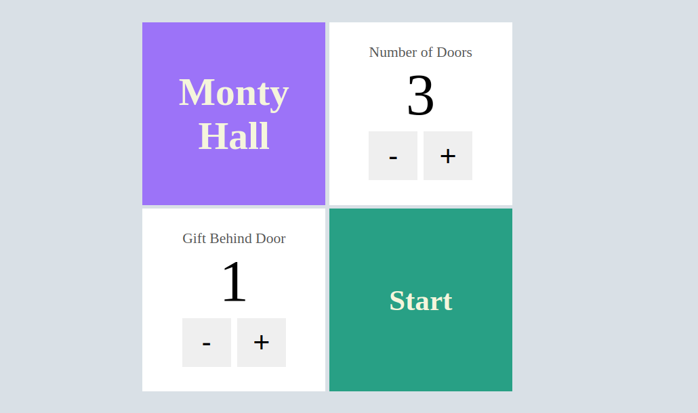
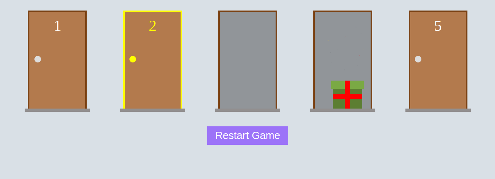

# Monty Hall




# Getting Started

>**Note**: Project created in [NextJs](https://nextjs.org/docs).


## Step 1: Install Node Modules

```bash
# using npm
npm install node
```

## Step 2: Start Project

```bash
# using npm
npm run dev
```

## Congratulations! :tada:

Congratulations, you successfully executed the MontyHall project! :partying_face:

- The development server will start at [http://localhost:3000](http://localhost:3000).

## project structure

```MontyHall/
|-- .next/
|-- assets/
|   |-- img/
|-- node_modules/
|-- public/
|-- src/
|   |-- components/
|   |   |-- Card.tsx
|   |   |-- Door.tsx
|   |   |-- Gift.tsx
|   |   |-- NumericInput.tsx
|   |-- functions/
|   |   |-- doors.ts
|   |-- model/
|   |   |-- Door.ts
|   |-- pages/
|   |   |-- api/
|   |   |-- game/
|   |   |   |-- [door]/
|   |   |   |   |-- [giftDoor]/
|   |   |   |   |   |-- index.jsx
|   |   |-- _app.js
|   |   |-- index.jsx
|   |-- styles/
|   |   |-- Card.module.css
|   |   |-- Door.module.css
|   |   |-- Form.module.css
|   |   |-- Game.module.css
|   |   |-- Gift.module.css
|   |   |-- global.module.css
|   |   |-- NumericInput.module.css
|   |-- animation.json
|   |-- index.js
|-- .gitignore
|-- jsconfig.json
|-- next-env.d.ts
|-- next.config.js
|-- package-lock.json
|-- package.json
|-- README.md
|-- tsconfig.json
```